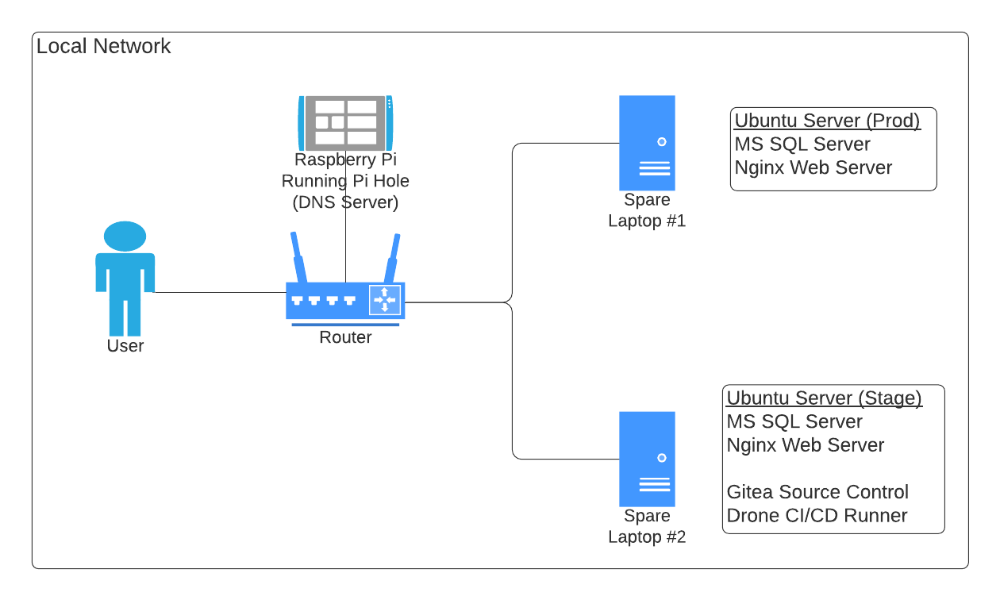

Using my two spare laptops and a Raspberry Pi 4, I set up my local network according to the diagram above. My "Stage" server is running on a Macbook Pro 2012 and the "Production" server is an Acer Aspire laptop I purchased for college back in 2009 or 2010. I am also using the Raspberry Pi as a DNS server so I can use human readable domain names on my local network instead of local IP addresses.

## Installing Ubuntu Server

Installation is very simple and straightforward so I won't go into it here, but you can visit the Ubuntu website [here](https://ubuntu.com/server/docs/installation) for detailed instructions.

The issue I encountered after installation was the wifi cards not working. Thankfully both of these laptops are old enough to have ethernet ports built in so I could easily access the internet by plugging into the router.

Both of these laptops have Broadcom wireless cards, and I had to manually install a couple extra packages in order to get them to work. Luckily this problem has plagued many people before me because there is an *outstanding* askubuntu [answer](https://askubuntu.com/questions/55868/installing-broadcom-wireless-drivers/) about this very issue.

Once I got the wireless cards working, it was smooth sailing.

## Installing Microsoft SQL Server

Again, I'm going to link an external page because Microsoft put together some very easy instructions for installing SQL Server on Linux [here](https://docs.microsoft.com/en-us/sql/linux/quickstart-install-connect-ubuntu?view=sql-server-ver15).

For my projects, I installed SQL Server Developer Edition, as well as both SSIS and SQL Agent - I use both in my personal finance app. However, SSIS ended up causing quite a headache because I noticed my machine was running at 80C while idling - this is absurdly high.

Using `htop`, I noticed the `ssis-telemetry` service was the primary resource hog. The telemetry service is its own service separate from SSIS itself, so I just stopped and disabled it. After that, the machine was idling at a much more comfortable 40C.

## Installing Nginx

With Nginx I am able to run multiple services on the same machine and proxy each request to the correct service based on the domain name.