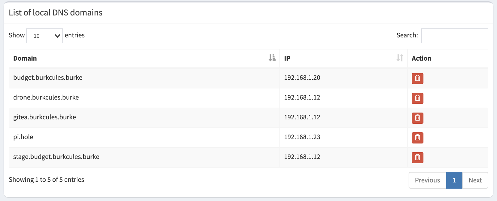
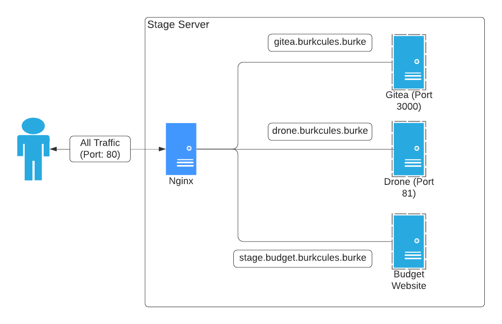

## Overview

Lately I've wanted to get some hands-on experience managing the network side of a full stack application and figured a a home server setup could be an easy, low stakes way to do it. Using my two old laptops, I'll have both a staging and production environment, as well as a Raspberry Pi 4 running Pi Hole for my local DNS server. The "application" I plan to run on my network is a personal budgeting web app I started working on last year. It was always intended for use by me alone, so this setup will be perfect.

As shown in the diagram above, both the staging and production environments will be running MS SQL Server and a Web Server (Nginx). However, the stage server will be pulling double duty by also hosting a local source control server (Gitea) and a CI/CD server (Drone). Both of these will run in separate docker containers.

**Why do I need to host my own source control and CI/CD servers?** Since I'm actively developing the budget app, I don't want to deal with manually deploying my code to two different environments. Moreover, my ISP regularly changes my public IP address so whatever cloud CI/CD solution I come up with will have no way to reliably deploy the code to my local environments.

In this post, I won't go into the installation steps for Ubuntu, SQL Server, etc., but rather I'll focus on the steps I took to get all of these services working together.

## DNS Server

Pi Hole makes setting up a local DNS server very easy. In the admin panel, you just need to add a domain name to the list of local DNS domains:



As you can probably figure out from the photo above, my stage server is running on 192.168.1.12 and production on 192.168.1.20. You'll notice there are multiple domains pointing to the stage server. All traffic for each of those domains will be traveling through port 80 to the same IP address, so we'll need to use Nginx's proxy functionality to route traffic to the right place.

## Nginx Proxy

The configuration I use on my stage server may not be the best way to do it, but so far it works quite well. In `nginx.conf` I added a server config for each of the separate domains, e.g.

```
# Omitted for brevity

http {
    # Omitted for brevity

    server {
        listen 80; # all traffic comes in to port 80 (I'm not using https on my local network)
        server_name gitea.burkcules.burke;

        location / {
            proxy_pass http://localhost:3000;
        }
    }

    # Additional server confs as necessary
}
```

With all necessary server confs included in `nginx.conf`, the traffic map will follow this diagram:

