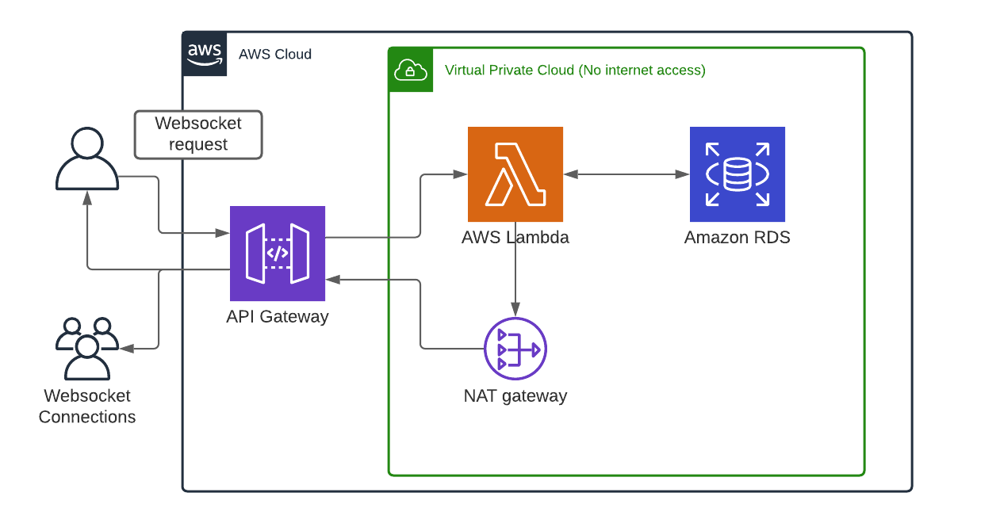
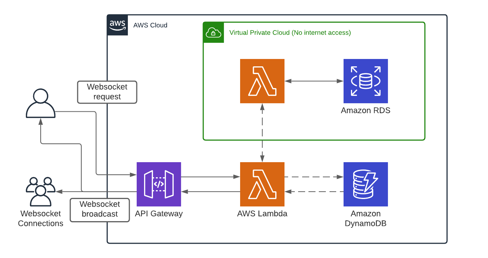

Another problem I encountered with this kind of setup is the load experienced by the database server. Every time someone makes a bid or sends a chat message, the lambda function needs to create a connection to the DB then call a stored procedure to perform the data update. This is fine for one or two auctions happening at the same time, but any more than that and the performance likely drops off a cliff.

I should note that a DB engine is more than capable than handling the workload described above; however I am limited by two things: 1) I'm cheap, 2) you can't do connection pooling to RDS SQL Server with lambdas (yet). My RDS instance is running on free tier's db.t2.micro instance which has a single core and only 1 gig of RAM, so it's really only suited for small, infrequent operations. For example, a website with a handful of REST requests by a small number of users.

### Proposed Rewrite

Given the constraints above, I need to offload my auction/websocket functionality to a different server. A great solution, and probably what I should have done in the first place, is to use DynamoDB.

The architecture in this diagram is what I think I'll use. I will still use RDS as my single source of truth, but I'll use Lambda/DynamoDB for the active auction workload. Here's the general workflow I envision:

1. A league admin starts the auction by grabbing the first team for sale from RDS
1. Users bid on that team until time runs out
1. A league admin completes the sale and puts the next team up for auction

I hinted at this above, but never explicitly stated it: in order for a lambda to connect to RDS, it must live inside the same VPC. And in order for a lambda to broadcast websocket messages, it needs internet access. VPC lambdas can get internet access through a NAT gateway, but lambdas outside a VPC have internet by default.

So in order for the workflow to function properly, any time we need to read or write data to RDS, we must call a regular lambda (outside a VPC) then have it invoke another lambda inside our VPC to perform the RDS operations.